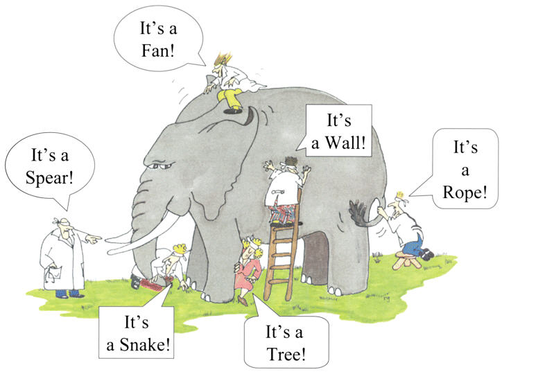

#HSLIDE

### Historias de Usuario

### Luis Mayta

- **Go enthusiast**
- **Python enthusiast**

- [@slovacus](https://twitter.com/slovacus)
- [github.com/luismayta](https://github.com/luismayta)

### Recordemos

---

### Scrum no es una metodologia es un Framework

### Vision

---

### Inception

---

### Historias de Usuario

+++

### Diagram

+++

### Perspectiva

### Requerimiento

* Los Requisitos del sistema están escritos desde la perspectiva del sistema y no en la interacción del usuario, representan las características en estado puro.

### Historia De Usuario

* sirven para describir lo que el usuario desea ser capaz de hacer.
* se centran en el valor que viene a usar el sistema en lugar de una especificación detallada de lo que el sistema debe hacer.
* Están concebidos como un medio para fomentar la colaboración.

--------------------------

### Perspectiva

### Estructura

--------------------------

+++

### Criterios de aceptación

---

### Criterios de aceptación

* **(Scenario) Escenario** [Número de escenario] [Titulo del escenario]:
* **(Given) En caso que** [Contexto] y adicionalmente [Contexto],
* **(When) cuando** [Evento],
* **(Then) entonces el sistema** [Resultado / Comportamiento esperado]

#### Some Related Links

* [La guia de scrum](http://www.scrumguides.org/docs/scrumguide/v2016/2016-Scrum-Guide-Spanish.pdf)
* [Javier Garzas Blog](http://www.javiergarzas.com/metodologias-agiles)
* [scrum y xp desde las trincheras](http://www.proyectalis.com/wp-content/uploads/2008/02/scrum-y-xp-desde-las-trincheras.pdf)

--------------

### Gracias

**No hay nada que no puedas, hacer si te lo propones**