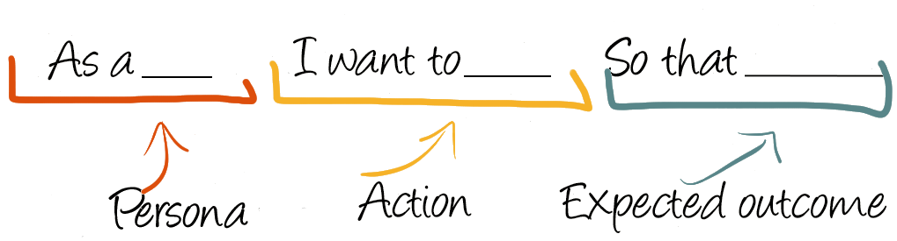
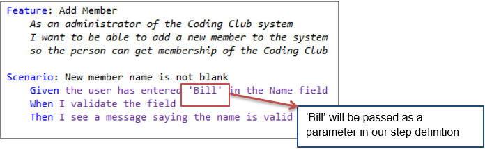

# Historias de Usuario

--------------------------

## Diagrama

--------------------------

# Perspectiva

--------------------------

## Requerimiento

--------------------------

## Historia De Usuario

--------------------------

## Perspectiva

--------------------------

## Estructura

--------------------------

--------------------------

## Criterios de aceptación

--------------------------

## Criterios de aceptación

* **(Scenario) Escenario** [Número de escenario] [Titulo del escenario]:
* **(Given) En caso que** [Contexto] y adicionalmente [Contexto],
* **(When) cuando** [Evento],
* **(Then) entonces el sistema** [Resultado / Comportamiento esperado]
