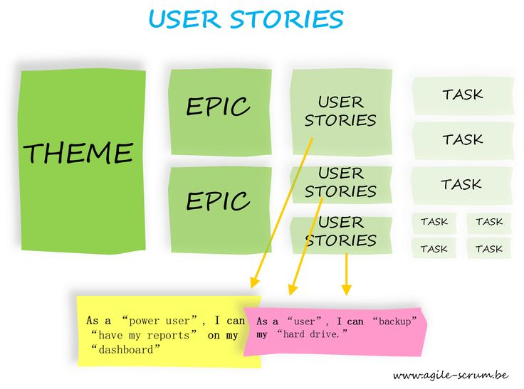

# Historias de Usuario

--------------------------

## Diagrama

--------------------------

# Perspectiva

--------------------------

## Requerimiento

* Los Requisitos del sistema están escritos desde la perspectiva del sistema y no en la interacción del usuario, representan las características en estado puro.

--------------------------

## Historia De Usuario

* sirven para describir lo que el usuario desea ser capaz de hacer.
* se centran en el valor que viene a usar el sistema en lugar de una especificación detallada de lo que el sistema debe hacer.
* Están concebidos como un medio para fomentar la colaboración.

--------------------------

--------------------------

## Perspectiva

--------------------------

## Estructura

--------------------------

--------------------------

## Criterios de aceptación

--------------------------

## Criterios de aceptación

* **(Scenario) Escenario** [Número de escenario] [Titulo del escenario]:
* **(Given) En caso que** [Contexto] y adicionalmente [Contexto],
* **(When) cuando** [Evento],
* **(Then) entonces el sistema** [Resultado / Comportamiento esperado]
